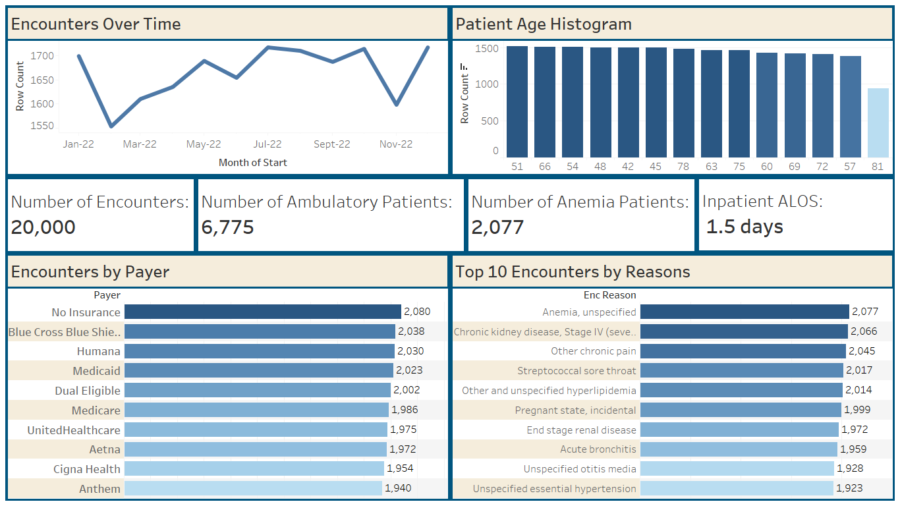

# **Project 3: Healthcare Encounters (Tableau)**  




## 📌 Project Overview
This Tableau dashboard analyzes **20,000+ hospital encounters** and provides insights into:
- Encounter trends over time  
- Payer mix distribution  
- Patient age patterns  
- Inpatient length of stay (ALOS)  
- Top visit reasons  

---

## 🗂️ Data Sources
- `encounters.csv`
- `patients.csv`
- `payers.csv`

---

## 🔧 Data Preparation (Tableau Prep)
- Cleaned payer types (Medicare, Medicaid, Private Insurance)  
- Extracted Month-of-Start from Encounter Date  
- Created encounter reason groupings  
- Converted age into histogram buckets  

---

## 📐 Calculated Fields

```tableau
Encounter_Month = DATETRUNC('month', [EncounterDate])
