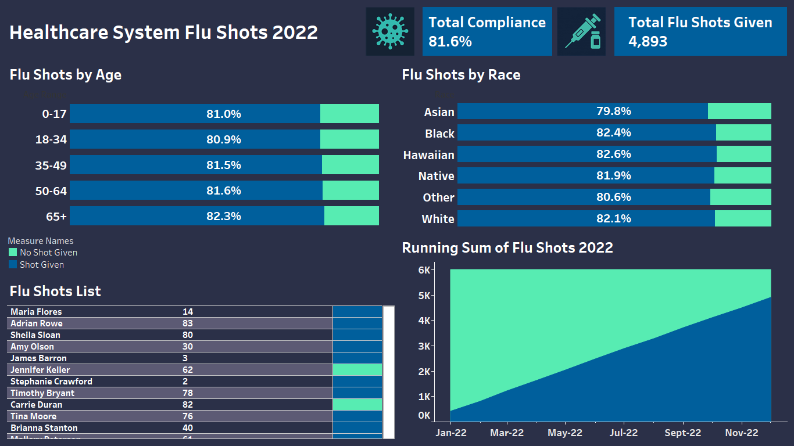

**Project 4: Flu Shots Compliance (Tableau)**  

## 📌 Project Overview
This Tableau dashboard analyzes **4,893 flu shots administered in 2022**, focusing on compliance behavior across age groups, races, and cumulative immunizations.

---

## 🗂️ Data Sources
- `flu_shots.csv`
- `patients.csv`

---

## 🔧 Data Preparation (Tableau Prep)
- Cleaned & standardized immunization records  
- Created compliance flags:
  - Shot Given  
  - No Shot  
- Generated age grouping and race classification fields  
- Extracted Year–Month of immunization  

---
