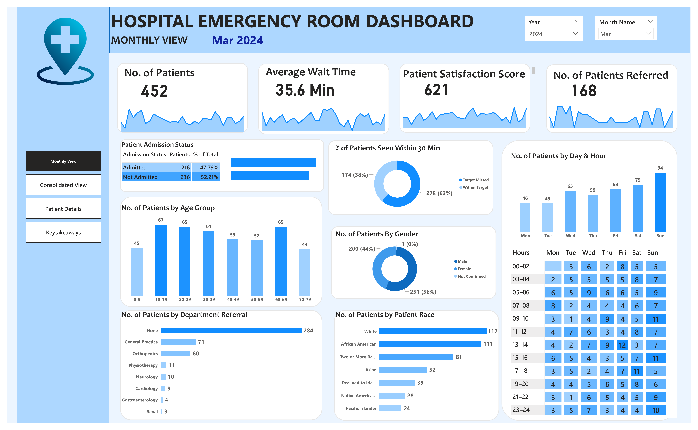

# Hospital Emergency Room Utilization and Performance Dashboard (Power BI)

📌 **Project Overview**

This Power BI project analyzes Emergency Room (ER) utilization, patient flow, wait-time performance, demographic patterns, referral behavior, and admission outcomes.
The dashboard supports operational monitoring, staffing optimization, and patient experience improvements.

🗂️ **Data Sources**

*   `er_data.csv` – Contains patient demographics, admission datetime, wait times, satisfaction scores, and referral details
*   `date_table` – Generated in Power BI using DAX for time-intelligence operations
*   Derived columns created during ETL:
    *   Patient Admin Date
    *   Admission Hour
    *   Day Name
    *   Age Group
    *   Wait Time Status
    *   Month-Year
    *   Weekday Number

🔧 **Data Engineering & Transformation (ETL)**

Performed in Power Query inside Power BI:

*   Removed duplicates and standardized inconsistent values
*   Extracted Date, Time, Hour, Day Name, and Month-Year from the Admission DateTime field
*   Converted binary admission flags into readable labels (Admitted / Not Admitted)
*   Created Age Group using 10-year bins
*   Classified patients into “Within Target” or “Target Missed” based on 30-minute wait-time threshold
*   Cleaned referral department values
*   Added hour-based intervals (Late Night, Morning, Afternoon, Evening)

🧩 **Data Modeling (Star Schema)**

*   Created a dedicated Date Table using DAX and marked it as a date table
*   Established one-to-many relationship:
    *   `DateTable[Date]` ---> `ERData[Patient Admin Date]`
*   Enabled time-intelligence for month-over-month analysis, trend evaluation, and flexible filtering

📊 **Dashboard Views**

*   **Monthly View**
    *   Month-Year slicer
    *   KPIs including:
        *   Number of Patients
        *   Average Wait Time
        *   Average Satisfaction Score
        *   Number of Patients Referred
        *   Admission Status distribution
        *   Age Group distribution
        *   Department Referral breakdown
    *   Daily trend sparklines

*   **Consolidated View**
    *   Custom date-range filters
    *   Multi-month utilization trends
    *   Referral patterns
    *   Admission vs. Non-Admission analysis

*   **Patient Details View**
    *   Patient ID
    *   Full Name
    *   Gender
    *   Age
    *   Race
    *   Admission Date
    *   Wait Time
    *   Referral Department
    *   Admission Status

**Key Takeaways / Insights**

*   Peak utilization hours and days
*   Wait-time target compliance insights
*   High-load demographic segments
*   Staffing optimization opportunities
*   Referral patterns across departments

📐 **DAX Measures**

*   Number of Patients
*   Average Wait Time
*   Average Satisfaction Score
*   Patients Referred
*   Total Admissions
*   Total Not Admitted
*   % Within Target
*   % Target Missed

🧮 **Calculated Columns**

*   Patient Full Name
*   Admission Status
*   Patient Admin Date
*   Age Group
*   Month-Year
*   Month Number
*   Admission Hour
*   Wait Time Status
*   Wait Time Interval
*   Day Name
*   Weekday Number

🧠 **Skills Demonstrated**

*   Power BI Desktop
*   Power Query ETL
*   Star Schema Modeling
*   DAX (Measures and Calculated Columns)
*   KPI design and trend analysis
*   Healthcare operations and utilization analytics
*   Dashboard storytelling and insight generation

